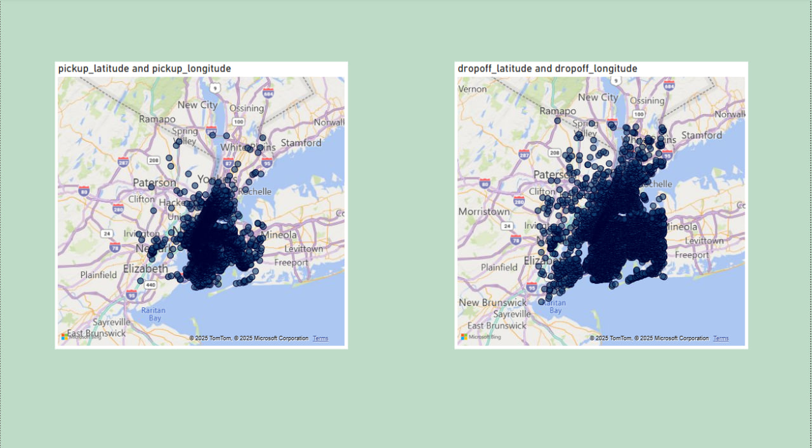
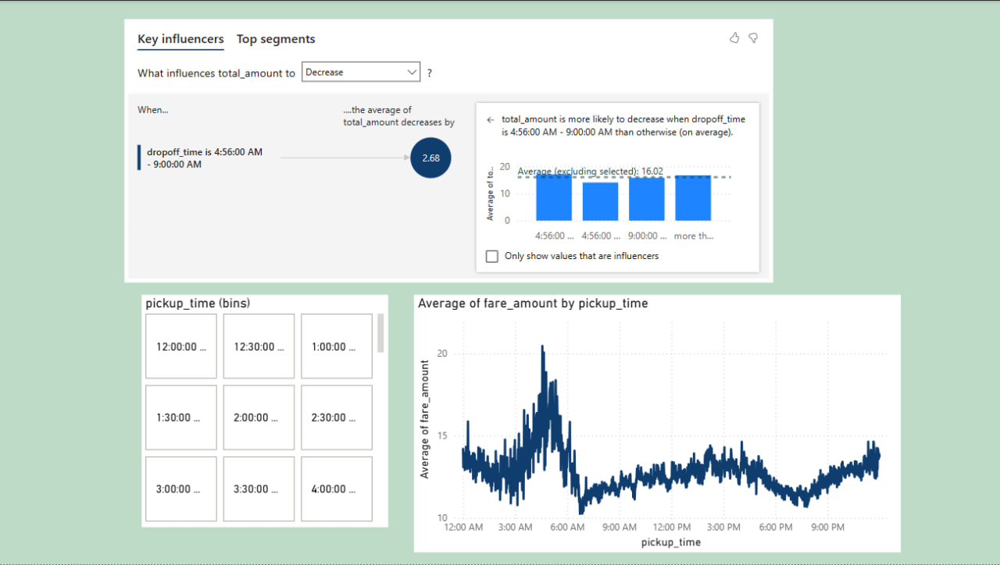
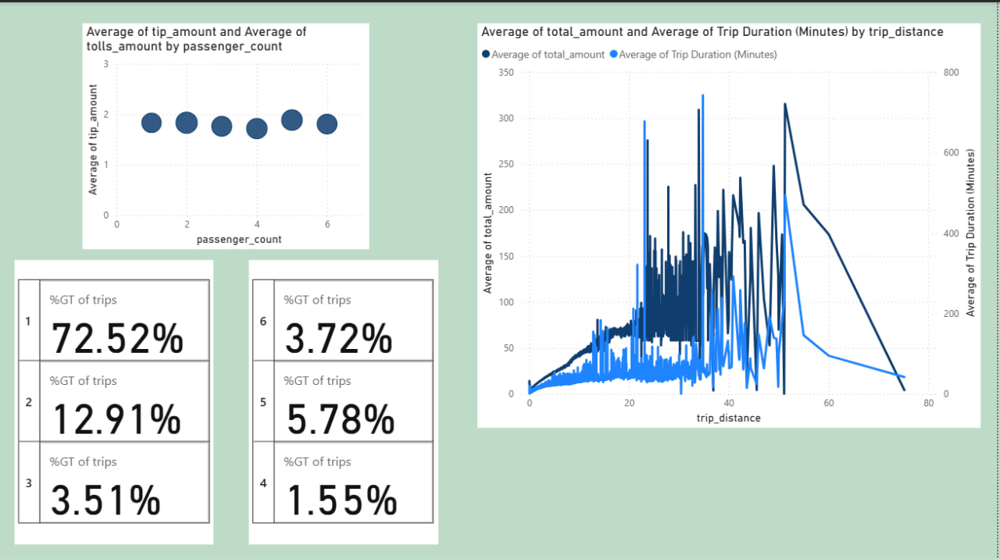
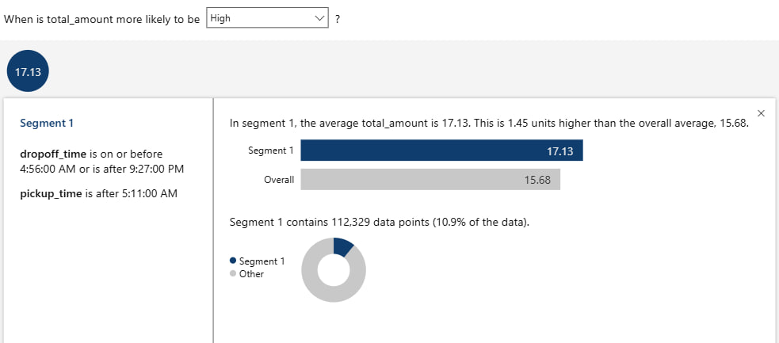

# NYC_Taxi


A comprehensive data analysis and visualization project exploring New York City taxi trip data to uncover patterns, trends, and business insights through interactive Power BI dashboards.


## 🚀 Quick Start

### Prerequisites
- Power BI Desktop
- Python 3.8+
- Jupyter Notebook (optional)

### Installation
```bash
# Clone the repository
git clone https://github.com/erfnghh/NYC_Taxi.git
cd nyc-taxi-analysis

# Install Python dependencies
pip install -r requirements.txt
```

### Usage
1. Open `nyc_taxi.pbix` in Power BI Desktop
2. Connect to your data source if needed
3. Use filters and slicers for interactive analysis

## 📁 Project Structure

```
nyc-taxi-analysis/
│
├── dashboard/
│   └── nyc_taxi.pbix          # Main Power BI dashboard
│
├── notebooks/
│   └──data_cleaning_analysis.ipynb           # Data preprocessing & outlier handling
│    
│
├── images/                              # Visualization exports
├── data/                                # Sample data
├── requirements.txt                     # Python dependencies
└── README.md
```


## 📊 Dashboard Overview

<div align="center">




  





</div>

## 🔍 Key Insights

### 📈 Performance Metrics
- **Avg Fare**: $12.42 per trip
- **Avg total-amount**: $15.68 per trip
- **Airport Routes**: higher revenue than city trips

### 🗺️ Geographic Analysis
- **Hotspots**: Manhattan, JFK/LGA airports

## 🛠️ Technical Features

### Data Processing
```python
# Advanced data cleaning pipeline
def clean_taxi_data(df):
    df = remove_geographic_outliers(df)
    df = filter_trip_durations(df, 0.1, 100)
    df = handle_missing_values(df)
    return df
```

### Power BI Capabilities
- **Interactive DAX measures and columns**
- **Custom geographic visualizations**
- **Time intelligence functions**

## 📊 Dataset

**Source**: [NYC TLC Trip 2016-3 Record Data](https://www.nyc.gov/site/tlc/about/tlc-trip-record-data.page)

**Columns Analyzed**:
- Pickup/Dropoff datetime & locations
- Trip distance & duration
- Fare amount,tip amount & total amount
- Passenger count & trip count

## 🎯 Business Applications

- **Revenue Optimization**:

<div align="center">

</div>

- **Pricing Strategy**: 

<div align="center">

</div>


---

⭐ **If you find this project useful, please give it a star on GitHub!**

---
